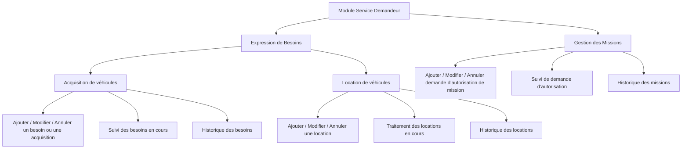
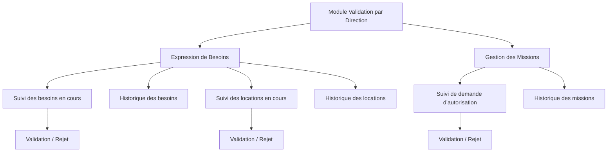
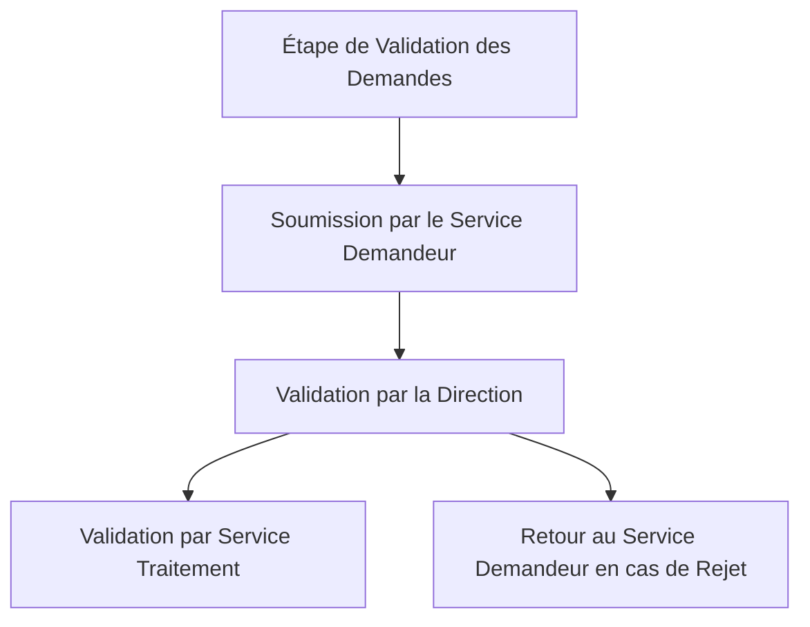

### 1. Module Service Demandeur

**a. Expression de Besoins**

**Acquisition de véhicules**

- **Ajouter / Modifier / Annuler un besoin ou une acquisition**
    1. L'utilisateur accède au formulaire d'expression de besoins.
    2. L'utilisateur sélectionne "Acquisition de véhicules".
    3. L'utilisateur remplit ou modifie les informations nécessaires (type de véhicule, quantité, justification).
    4. L'utilisateur soumet le formulaire pour validation ou annule l'opération.
- **Suivi des besoins en cours**
    1. L'utilisateur accède à la liste des besoins en cours.
    2. L'utilisateur peut visualiser l'état de chaque besoin (en attente, approuvé, rejeté).
    3. L'utilisateur peut modifier ou annuler un besoin en attente.
- **Historique des besoins**
    1. L'utilisateur accède à l'historique des besoins.
    2. L'utilisateur peut visualiser les détails de chaque besoin traité.

**Location de véhicules**

- **Ajouter / Modifier / Annuler une location**
    1. L'utilisateur accède au formulaire de location de véhicules.
    2. L'utilisateur remplit ou modifie les informations nécessaires (type de véhicule, durée, justification).
    3. L'utilisateur soumet le formulaire pour validation ou annule l'opération.
- **Traitement des locations en cours**
    1. L'utilisateur accède à la liste des locations en cours.
    2. L'utilisateur peut visualiser l'état de chaque location (en attente, approuvé, rejeté).
    3. L'utilisateur peut modifier ou annuler une location en attente.
- **Historique des locations**
    1. L'utilisateur accède à l'historique des locations.
    2. L'utilisateur peut visualiser les détails de chaque location traitée.

**b. Gestion des Missions**

- **Ajouter / Modifier / Annuler demande d’autorisation de mission**
    1. L'utilisateur accède au formulaire de demande d’autorisation de mission.
    2. L'utilisateur remplit ou modifie les informations nécessaires (date, lieu, objectif).
    3. L'utilisateur soumet le formulaire pour validation ou annule l'opération.
- **Suivi de demande d’autorisation**
    1. L'utilisateur accède à la liste des demandes d’autorisation en cours.
    2. L'utilisateur peut visualiser l'état de chaque demande (en attente, approuvé, rejeté).
    3. L'utilisateur peut modifier ou annuler une demande en attente.
- **Historique des missions**
    1. L'utilisateur accède à l'historique des missions.
    2. L'utilisateur peut visualiser les détails de chaque mission autorisée.

### 2. Module Validation par Direction

**a. Expression de Besoins**

**Acquisition de véhicules**

- **Suivi des besoins en cours**
    1. La direction accède à la liste des besoins en cours soumis par le service demandeur.
    2. La direction examine chaque besoin et valide, rejette, ou demande des modifications.
- **Historique des besoins**
    1. La direction accède à l'historique des besoins validés ou rejetés.
    2. La direction peut visualiser les détails de chaque besoin traité.

**Location de véhicules**

- **Suivi des locations en cours**
    1. La direction accède à la liste des locations en cours soumis par le service demandeur.
    2. La direction examine chaque location et valide, rejette, ou demande des modifications.
- **Historique des locations**
    1. La direction accède à l'historique des locations validées ou rejetées.
    2. La direction peut visualiser les détails de chaque location traitée.

**b. Gestion des Missions**

- **Suivi de demande d’autorisation**
    1. La direction accède à la liste des demandes d’autorisation en cours.
    2. La direction examine chaque demande et valide, rejette, ou demande des modifications.
- **Historique des missions**
    1. La direction accède à l'historique des missions autorisées ou rejetées.
    2. La direction peut visualiser les détails de chaque mission traitée.

### 3. Module Validation Service Traitement (DARH)

**a. Expression de Besoins**

**Acquisition de véhicules**

- **Suivi des besoins en cours**
    1. Le service traitement accède à la liste des besoins en cours validés par la direction.
    2. Le service traitement valide, rejette, ou traite les besoins pour finalisation.
- **Historique des besoins**
    1. Le service traitement accède à l'historique des besoins traités.
    2. Le service traitement peut visualiser les détails de chaque besoin finalisé.

**Location de véhicules**

- **Suivi des locations en cours**
    1. Le service traitement accède à la liste des locations en cours validées par la direction.
    2. Le service traitement valide, rejette, ou traite les locations pour finalisation.
- **Historique des locations**
    1. Le service traitement accède à l'historique des locations traitées.
    2. Le service traitement peut visualiser les détails de chaque location finalisée.

**b. Gestion des Missions**

- **Suivi de demande d’autorisation**
    1. Le service traitement accède à la liste des demandes d’autorisation validées par la direction.
    2. Le service traitement valide, rejette, ou traite les demandes pour finalisation.
- **Historique des missions**
    1. Le service traitement accède à l'historique des missions traitées.
    2. Le service traitement peut visualiser les détails de chaque mission finalisée.

### IV. Étape de Validation des Demandes

1. **Soumission par le Service Demandeur :**
    - Le service demandeur remplit le formulaire d'expression de besoins ou de gestion des missions.
    - La demande est soumise à la direction pour validation.
2. **Validation par la Direction :**
    - La direction examine la demande soumise.
    - Si la demande est approuvée, elle est transmise au service traitement pour finalisation.
    - Si la demande est rejetée ou nécessite des modifications, un retour est fait au service demandeur.

Ces workflows assurent une gestion fluide des processus et une traçabilité des demandes, de leur création à leur finalisation.
